# Expense Tracker — Android App

## Screenshots

| Login | Register | Home (Light) | Home (Dark) |
|---|---|---|---|
| 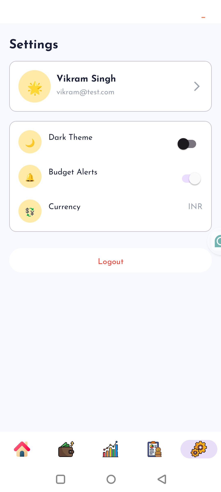 | 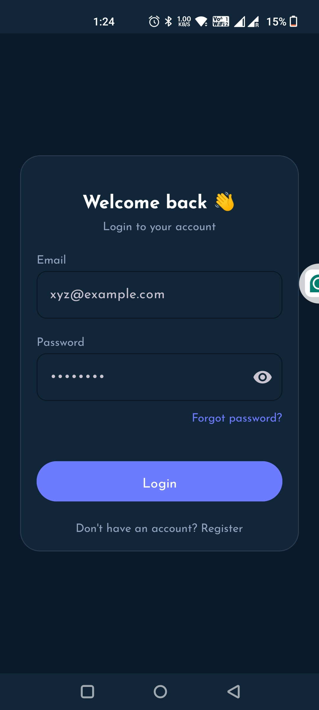 | 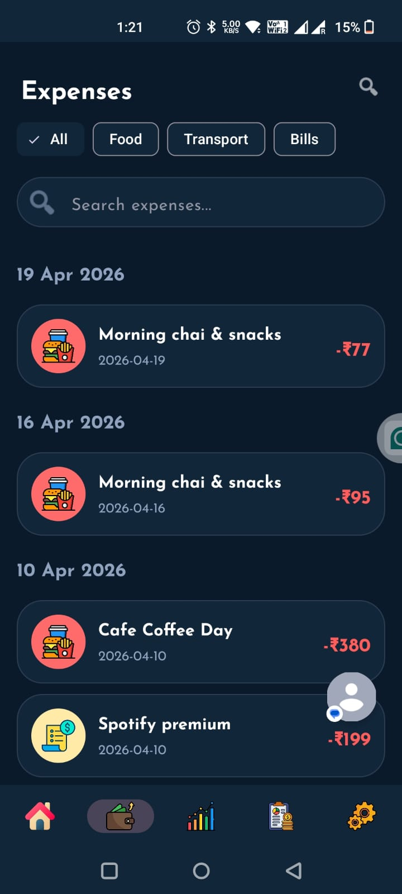 | 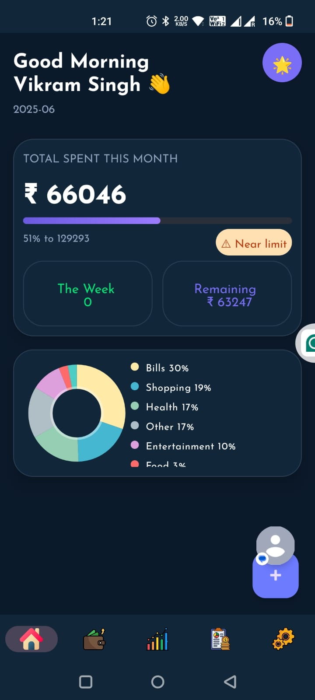 |

| Expense List (Light) | Expense List (Dark) | Add Expense | Set Budget Dialog |
|---|---|---|---|
| 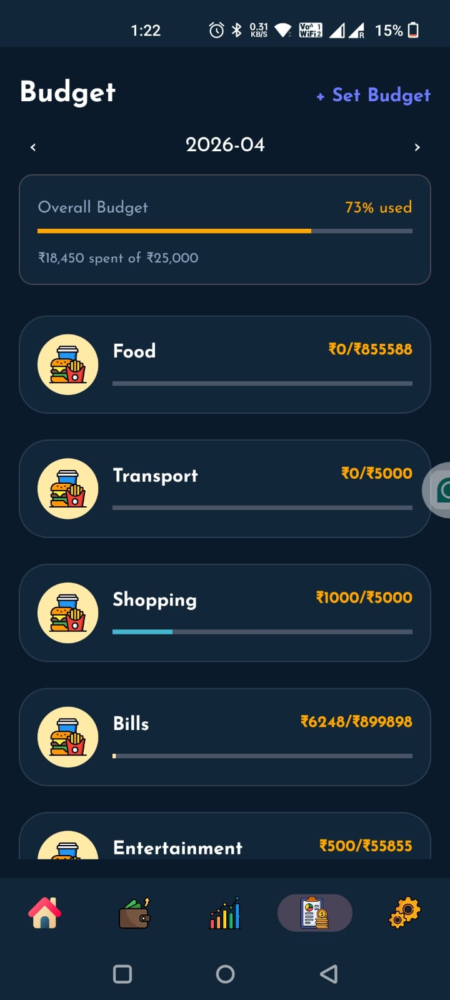 | 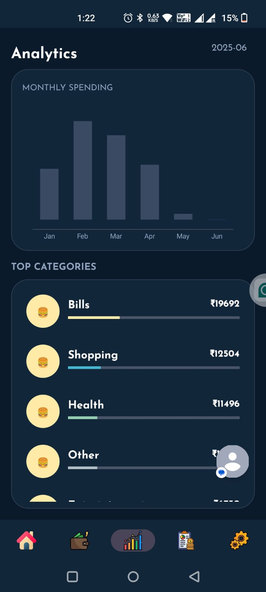 | 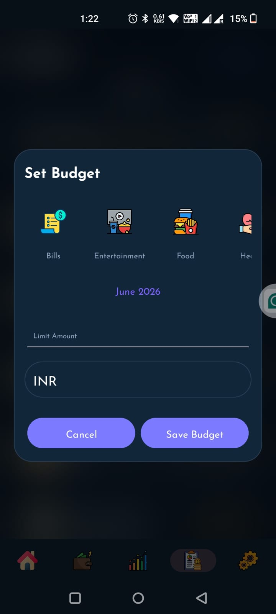 | 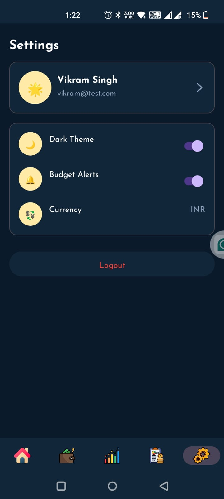 |

| Budget (Light) | Budget (Dark) | Analytics (Light) | Analytics (Dark) |
|---|---|---|---|
| 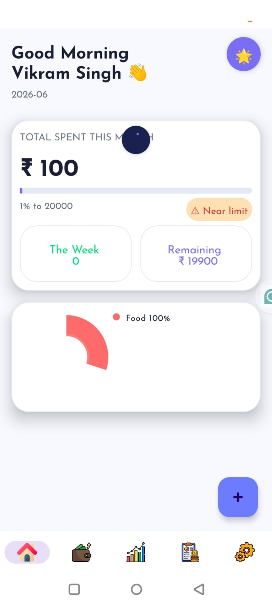 | 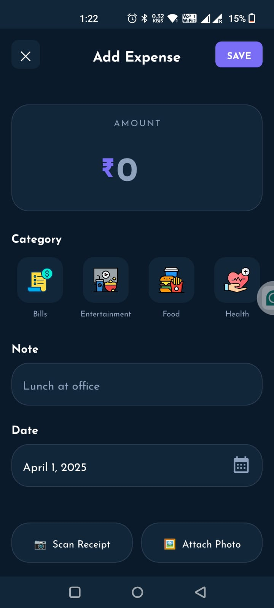 | 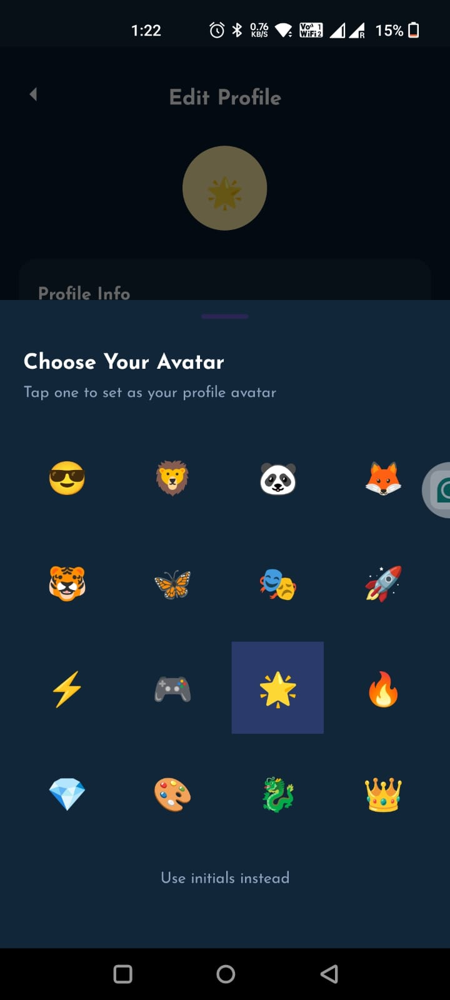 | 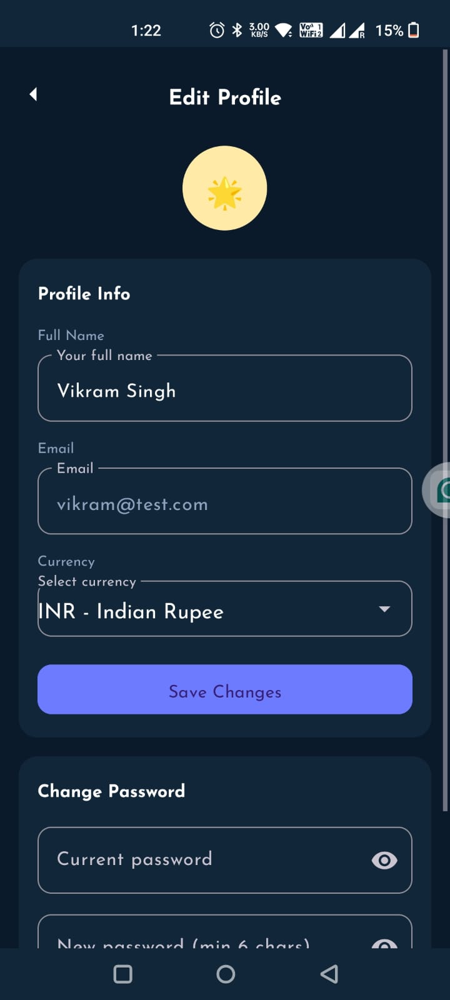 |

| Settings (Light) | Settings (Dark) | Edit Profile | Choose Avatar |
|---|---|---|---|
| 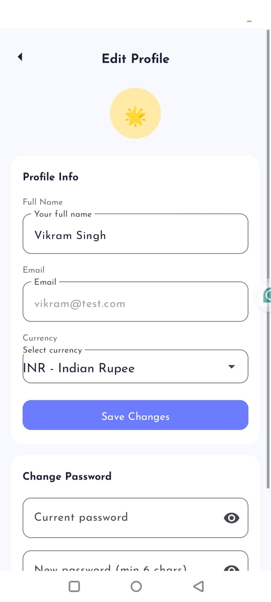 | 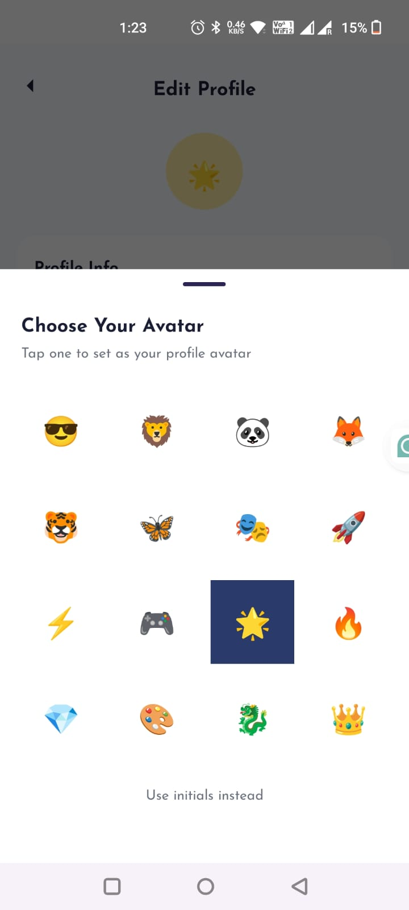 | 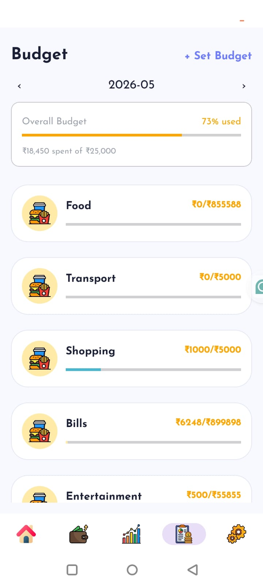 | 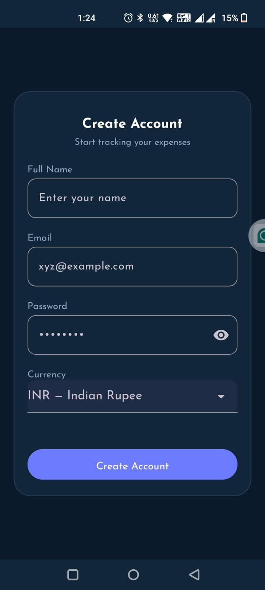 |


An Android expense management app built with Kotlin. It lets users register/login, add and categorize expenses, set budgets, view analytics, and automatically detect transactions via SMS. The app works offline-first using a local Room database that syncs with a remote API.

---

## Features

- **Authentication** — Register and login with JWT-based auth; token managed via `TokenManager`
- **Expense Management** — Add, view, and delete expenses with categories, notes, and dates
- **SMS Auto-Detection** — Listens for incoming SMS messages and parses bank transaction alerts to auto-fill expenses
- **Budget Tracking** — Set monthly budgets per category and monitor spending progress
- **Analytics** — Pie charts and bar charts (via MPAndroidChart) showing spending by category and month
- **Offline-First** — Room database caches expenses locally; pending expenses sync when network is restored
- **Dark Mode** — Toggle via Settings screen, persisted in SharedPreferences
- **Lottie Animations** — Splash screen and loading states use Lottie JSON animations

---

## Tech Stack

| Layer | Library / Tool |
|---|---|
| Language | Kotlin |
| UI | XML Layouts, ViewBinding, DataBinding |
| Navigation | Jetpack Navigation Component |
| DI | Hilt (Dagger) |
| Networking | Retrofit 2 + OkHttp + Gson |
| Local DB | Room (with Flow + Coroutines) |
| Async | Kotlin Coroutines + LiveData |
| Charts | MPAndroidChart |
| Image Loading | Glide |
| Animations | Lottie |
| Debug | Chucker (network inspector) |
| Min SDK | 24 (Android 7.0) |
| Target SDK | 34 (Android 14) |

---

## Project Structure

```
app/src/main/java/com/example/
├── expense/                    # Fragments & MainActivity
│   ├── MainActivity.kt
│   ├── SplashFragment.kt
│   ├── LoginFragment.kt
│   ├── RegisterFragment.kt
│   ├── HomeFragment.kt
│   ├── AddExpenseFragment.kt
│   ├── EspenceListFragment.kt
│   ├── ExpanseDetailFragment.kt
│   ├── BudgetFragment.kt
│   ├── AnalyticsFragment.kt
│   ├── SettingsFragment.kt
│   ├── DashboardFragment.kt
│   └── ReceiptScannerFragment.kt
│
├── data/
│   ├── model/                  # API models & Repository
│   │   └── Repository.kt
│   ├── local/                  # Room DB, DAOs, Entities, Mappers
│   │   ├── ExpenseDatabase.kt
│   │   ├── ExpenseDao.kt
│   │   ├── ExpenseEntity.kt
│   │   ├── PendingExpenseDao.kt
│   │   ├── PendingExpenseEntity.kt
│   │   ├── ExpenseMappers.kt
│   │   ├── PendingExpenseMappers.kt
│   │   └── NetworkMonitor.kt
│   ├── Api/
│   │   ├── AppModule.kt        # Hilt module for Retrofit
│   │   └── DatabaseModule.kt   # Hilt module for Room
│   ├── UiState.kt
│   └── NavEvent.kt
│
├── receiver/
│   └── SmsReceiver.kt          # BroadcastReceiver for SMS parsing
│
└── Utlity/
    ├── Utils.kt
    ├── TokenManager.kt
    ├── AuthInterceptor.kt
    └── BaseRecyclerAdapter.kt
```

---

## Getting Started

### Prerequisites

- Android Studio Hedgehog or later
- JDK 11+
- Android SDK 34
- A running backend API (update the base URL in `AppModule.kt`)

### Clone the repository

```bash
git clone https://github.com/<your-username>/Expense.git
cd Expense
```

### Add your API base URL

Open `app/src/main/java/com/example/data/Api/AppModule.kt` and update:

```kotlin
private const val BASE_URL = "https://your-api-base-url.com/"
```

### Build & Run

```bash
# Debug build
./gradlew assembleDebug

# Install on connected device
./gradlew installDebug

# Run unit tests
./gradlew test

# Run instrumented tests
./gradlew connectedAndroidTest
```

Or open the project in Android Studio and click **Run**.

---

## Permissions

The app requests the following permissions at runtime:

| Permission | Purpose |
|---|---|
| `INTERNET` | API communication |
| `ACCESS_NETWORK_STATE` | Offline detection |
| `RECEIVE_SMS` | Auto-detect bank transaction SMS |
| `READ_SMS` | Parse transaction details from SMS |

---

## Offline Support

Expenses are stored in a local Room database (`ExpenseDatabase`). When the device is offline, new expenses are saved to a `PendingExpense` queue and synced to the server automatically when connectivity is restored. `NetworkMonitor` tracks connectivity state using `ConnectivityManager`.

See [`docs/ROOM_INTEGRATION.md`](docs/ROOM_INTEGRATION.md) for a detailed breakdown of the offline-first architecture.

---

## Key Dependencies (from `libs.versions.toml`)

```toml
agp = "8.3.2"
kotlin = "2.0.21"
hilt = "2.56.2"
room = "2.6.1"
```

Full dependency list is in `app/build.gradle.kts`.

---

## Contributing

1. Fork the repository
2. Create a feature branch: `git checkout -b feature/my-feature`
3. Commit your changes: `git commit -m "Add my feature"`
4. Push to your branch: `git push origin feature/my-feature`
5. Open a Pull Request

---

## License

This project is for educational/personal use. Add your license here if you plan to distribute it.
